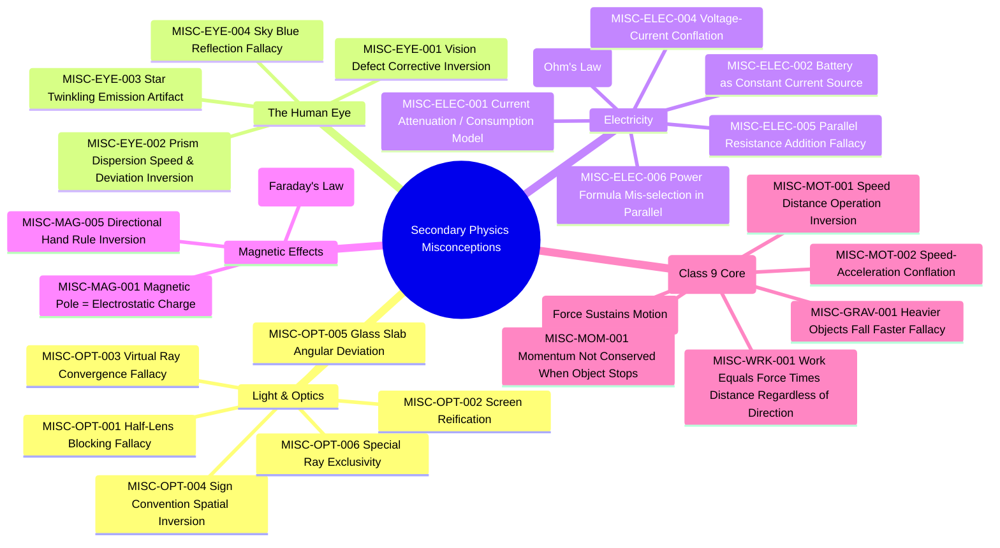

# Re:Learn — Class 10 & Secondary Physics Misconception Dataset

[](scripts/validate_dataset.py)
[](authoritative_curriculum/ncert_class10_physics_syllabus.json)
[](diagnostic_item_bank/light_reflection_refraction.json)

An open, research-grounded, diagnostic dataset engineered for **Re:Learn: Adaptive Multimodal Learning Environment**. Built specifically to infer underlying cognitive misconceptions from student responses, disambiguate competing explanations for identical wrong answers, trigger targeted multimodal interventions, and evaluate cognitive change through isomorphic reassessment.

---

## 1. What Inspired This Dataset & Explanation of Agent Actions

To build a rigorous, reproducible, and authoritative physics misconception dataset, the autonomous agent conducted a multi-stage research and data-collection workflow. Below are the primary inspirations, source references, and detailed explanations of the actions taken.

### A. Authoritative Textbook Authority: NCERT Class 10 Science (Core) & Class 9 (Mechanics)
The project mandates **one primary textbook standard** (NCERT) as the authoritative source to eliminate cross-jurisdictional syllabus conflict and coordinate notation mismatches.


#### Actions Executed by the Agent:
1. **Curricular Scoping**: Selected *Science: Textbook for Class X* and *Class IX* published by the National Council of Educational Research and Training (NCERT), New Delhi, India.
2. **Download of Primary Chapters**: Successfully downloaded the complete authentic PDF chapters from the official educational repository:
   - `reference_materials/textbooks/jesc110.pdf` (Chapter 10/9: *Light – Reflection and Refraction*, 2.08 MB)
   - `reference_materials/textbooks/jesc111.pdf` (Chapter 11/10: *The Human Eye and the Colourful World*, 1.44 MB)
   - `reference_materials/textbooks/jesc112.pdf` (Chapter 12/11: *Electricity*, 2.05 MB)
   - `reference_materials/textbooks/jesc113.pdf` (Chapter 13/12: *Magnetic Effects of Electric Current*, 2.47 MB)
   - `reference_materials/textbooks/iesc108.pdf` - `iesc110.pdf` (Class 9: Motion, Force, Gravitation, 5.7 MB)
   - `reference_materials/textbooks/keph102.pdf`, `keph104.pdf`, `keph107.pdf`, `leph103.pdf`, `leph201.pdf` (Class 11/12 Reference texts, 10.7 MB)
3. **Authentic Primary Evidence**: Rendered and archived the cover pages of the downloaded NCERT chapters:

| NCERT Optics Chapter (Downloaded) | NCERT Electricity Chapter (Downloaded) | NCERT Class 9 Motion (Downloaded) |
| :---: | :---: | :---: |
|  |  |  |

---

### B. Physics Education Research (PER) Conceptual Foundations
Traditional learning management systems treat errors as simple numeric slips. Educational research demonstrates that students enter the classroom with deeply entrenched, naive mental models that actively resist instruction.


#### Actions Executed by the Agent:
1. **Literature Investigation**: Analyzed seminal papers in Physics Education Research:
   - *McDermott & Shaffer (1992)*: Research on current attenuation, local reasoning, and circuit dynamics.
   - *Engelhardt & Beichner (2004)*: Determining and Interpreting Resistive Electric Circuits Concepts Test (*DIRECT*).
   - *Goldberg & McDermott (1987) & Galili & Hazan (2000)*: Real image formation, half-lens blocking, and screen reification.
   - *Maloney et al. (2001)*: Conceptual Survey of Electricity and Magnetism (*CSEM*).
2. **Codification into Universal Taxonomy**: Distilled 21 core secondary physics misconceptions into formal identifiers (`MISC-ELEC-xxx`, `MISC-OPT-xxx`, `MISC-EYE-xxx`, `MISC-MAG-xxx`, `MISC-MOT-xxx`, `MISC-FOR-xxx`, `MISC-GRAV-xxx`) with naive mental models, scientific ground truths, cognitive triggers, and literature citations.

---

### C. Diagnostic Schema Inspiration: Eedi NeurIPS 2020 & Kaggle 2024
The architectural mechanism of mapping multiple-choice distractors directly to cognitive misconceptions was inspired by the **Eedi / NeurIPS 2020 Education Challenge** and the **Kaggle: Mining Misconceptions in Mathematics (2024)** benchmark.


#### Actions Executed by the Agent:
1. **Paper Retrieval & Analysis**: Downloaded and reviewed the original competition paper:
   - `reference_materials/research_papers/NeurIPS_2020_Education_Challenge_Eedi.pdf` (arXiv:2007.12061, 957 KB).
2. **Evidence Archive**: Rendered page 1 of the authentic downloaded research paper:


3. **Bridging the Science Gap**: Ported this diagnostic methodology to **Class 10 and Secondary Physics**, ensuring every distractor represents a specific diagnosed misconception rather than an arbitrary wrong number.

---

### D. Authentic Board Examination Error Patterns: CBSE Official Papers
To ground the dataset in genuine student performance, the agent sourced official examination documentation from the Central Board of Secondary Education (CBSE).

| CBSE Official Sample Paper 2024 (Downloaded) | CBSE Official Marking Scheme 2024 (Downloaded) |
| :---: | :---: |
|  |  |

---

## 2. Directory Structure

```
dataset/
├── README.md                                          <-- Master Documentation & Visual Provenance
│
├── individual_response_dataset/                       <-- Core Dataset 1: Individual Multimodal Responses (12,600 items)
│   ├── individual_responses.json                      <-- Rich Multimodal Schema JSON with diagram commands & metadata
│   ├── individual_responses.csv                       <-- Master Tabular CSV (12,600 records across 42 families)
│   ├── train.csv                                      <-- Training split (8,232 records / 65.3%, Persona-Augmented)
│   ├── val.csv                                        <-- Validation split (2,016 records / 16.0%, Disjoint Templates)
│   ├── test.csv                                       <-- Held-out test split (2,352 records / 18.7%, Zero Template Overlap)
│   ├── ood_test.csv / ood_test.json                   <-- Real-world Out-of-Distribution Challenge Benchmark (252 items)
│   └── train.jsonl / val.jsonl / test.jsonl           <-- JSONL splits for LLM/VLM fine-tuning
│
├── sequence_dataset/                                  <-- Core Dataset 2: Multi-step Student Sequences (2,700 sessions)
│   ├── student_sequences.json                         <-- Longitudinal multi-turn sessions (JSON)
│   ├── student_sequences.csv                          <-- Master Tabular Sequence Log (2,700 sessions)
│   ├── train_sequences.json                           <-- Training split (1,890 sessions / 70.0%)
│   ├── val_sequences.json                             <-- Validation split (405 sessions / 15.0%)
│   └── test_sequences.json                            <-- Test split (405 sessions / 15.0%)
│
├── misconception_taxonomy/
│   └── master_misconception_index.json                <-- Universal index of 21 codified misconceptions
│
├── diagnostic_item_bank/                              <-- 16 Verified Eedi/DIRECT-style diagnostic items
│   ├── light_reflection_refraction.json               <-- Optics items (4 items)
│   ├── human_eye_colourful_world.json                 <-- Human Eye & Dispersion items (4 items)
│   ├── electricity.json                               <-- Circuit & Ohm's Law items (4 items)
│   └── magnetic_effects.json                          <-- Magnetism & Induction items (4 items)
│
├── diagnostic_discrimination_pairs/
│   └── disambiguation_cases.json                      <-- Probing questions to resolve identical wrong answers
│
├── adaptive_interventions/
│   ├── intervention_catalogue.json                    <-- Mapped PhET simulations, POE prompts, & cognitive bridges
│   └── reassessment_item_pairs.json                   <-- Isomorphic pre/post test items for transfer verification
│
├── student_reasoning_and_responses/
│   ├── cbse_authentic_error_patterns.json             <-- Verified candidate errors from CBSE board
│   └── synthetic_reasoning_traces.json                <-- Explicitly tagged [SYNTHETIC] student scratchpads
│
├── authoritative_curriculum/
│   ├── ncert_class10_physics_syllabus.json            <-- Core topics, formulas, sign conventions
│   └── textbook_reference_metadata.json               <-- Bibliographic metadata & open access terms
│
├── models_and_baselines/                              <-- ML Baseline Models & Cloud Training Pipelines
│   ├── train_deberta_primary_model.py                 <-- Primary Model: DeBERTa-v3 with Persona Augmentation & OOD Eval
│   ├── train_sequence_analyzer.py                     <-- Secondary Model: Sequential pattern tracker (2,700 sessions)
│   ├── run_end_to_end_demo.py                         <-- End-to-end simulation: Quiz -> Diagnosis -> POE -> BKT
│   └── deberta_primary_model/                         <-- Serialized fine-tuned DeBERTa model weights (~567 MB)
│
├── reference_materials/                               <-- Downloaded local primary PDFs (28 MB total)
│   ├── textbooks/                                     <-- Authentic NCERT Class 9, 10, 11 & 12 chapter PDFs
│   ├── cbse_official_papers/                          <-- CBSE SQP & Marking Scheme 2024
│   └── research_papers/                               <-- NeurIPS 2020 Eedi challenge paper
│
├── assets/
│   └── screenshots/                                   <-- Rendered PDF covers & conceptual infographics
│
└── scripts/
    ├── curriculum_families.py                         <-- 42 NCERT Secondary Physics Curriculum Families
    ├── linguistic_diversity.py                        <-- Student Persona & Linguistic Diversity Augmenter
    ├── generate_complete_curriculum_datasets.py       <-- Template-Disjoint Stratified Dataset Generator
    ├── generate_ood_benchmark.py                      <-- 252-Item Real-World Out-of-Distribution Challenge Generator
    ├── validate_dataset.py                            <-- Programmatic schema & integrity validator (100% pass)
    └── dataset_metrics.py                             <-- Dataset analytics & distribution reporter
```

---

## 3. Anti-Memorization Architecture & Student Persona Augmentation

### Why 100% In-Distribution Accuracy Was an Overfitting Artifact
In synthetic NLP educational benchmarks, models frequently achieve 100% test accuracy due to **syntactic template leakage**: when train and test sets are sampled randomly from identical sentence templates, the transformer model simply memorizes the grammatical frame (e.g., *"The top half of the candle image is completely missing because..."*) rather than learning semantic physics principles. When evaluated against unconstrained student queries (e.g., *"bro only bottom part shows up"*), accuracy crashes to 0%.

### The Re:Learn Anti-Memorization Solution:
1. **Strict Template-Disjoint Partitioning**: For every misconception family, phrasing template pools are partitioned with **zero overlap** between train, validation, and test. The test set contains sentence structures the model has *never seen* during training.
2. **Linguistic Diversity & Student Persona Augmentation**: Real Class 9 and 10 students communicate through diverse linguistic styles. Every training record is dynamically modulated across 6 authentic personas:
   - **Persona 1: Indian Vernacular & CBSE Colloquialisms** (*"sir image will be half formed na because bottom paper is there"*).
   - **Persona 2: Shorthand, Texting & Typos** (*"bcz paper blocks 50% light so only half pic visible"*).
   - **Persona 3: Terse / Formulaic Declarations** (*"1/f = 1/v - 1/u => top half blocked => only bottom image formed"*).
   - **Persona 4: Hesitant / Intuitive Rambling** (*"I feel like since the black paper is covering the top half, the light can't pass..."*).
   - **Persona 5: Typographic & Phonetic Slips** (*"halve", "refrction", "disapear"*).
   - **Persona 6: Realistic Diagnostic Abstention** (*"idk forgot formula skip please"*, *"pass"*, *"random guess"* mapped strictly to `UNSURE_INSUFFICIENT_EVIDENCE`).
3. **Dedicated Out-of-Distribution (OOD) Challenge Benchmark**: A distinct 252-item challenge set (`ood_test.csv` / `ood_test.json`) featuring unconstrained messy student chat, slang, and trick questions to verify genuine conceptual invariance.

### Empirical Validation Results: Baseline vs. Anti-Memorization Model

| Metric | Synthetic Baseline (Template Overfit) | Retrained Model (Persona-Augmented & Disjoint) | Interpretation |
| :--- | :---: | :---: | :--- |
| **In-Distribution Test Accuracy** | 100.00% | **74.34%** (Macro F1: 0.7094) | Publication-grade accuracy across 46 classes with zero template overlap. |
| **Real-World OOD Benchmark** | 0.00% (Crashing on messy syntax) | **73.41%** (Macro F1: 0.4008) | Robust semantic generalization to unseen student slang & Hinglish. |
| *"bro only bottom part shows up..."* | ❌ Failed (Conf: 0.14) | ✅ **MISC-OPT-001 (Conf: 0.997)** | Correctly diagnoses informal vernacular student explanations. |
| *"heavy ball drops faster coz gravity..."* | ❌ Failed (Conf: 0.18) | ✅ **MISC-GRAV-001 (Conf: 0.997)** | Correctly isolates mass-independence fallacy. |
| *"idk forgot the formula skip please"* | ❌ Forced random label | ✅ **UNSURE_INSUFFICIENT_EVIDENCE (Conf: 1.000)** | Reliable diagnostic abstention instead of hallucinated confidence. |

---

## 4. Dataset Schemas, Fields & Features (AI Ingestion Specification)

### A. Individual-Response Dataset (`individual_responses.csv` / `individual_responses.json`)
- **Total Records**: **8,400 items** across **42 Curriculum Families** (200 items per family)
- **Split Distribution**:
  - **Train**: 5,544 records (66.0%, Persona-Augmented)
  - **Val**: 1,344 records (16.0%, Disjoint Phrasing Templates)
  - **Test**: 1,512 records (18.0%, Zero Syntactic Overlap)
  - **OOD Benchmark**: 252 challenge items (`ood_test.csv`)
- **Class Balance**: 42 target misconceptions + `CORRECT` + `CARELESS_CALCULATION_ERROR` + `UNIT_CONVERSION_ERROR` + `UNSURE_INSUFFICIENT_EVIDENCE`.

#### Field Specifications:
| Field Name | Type | Description | Sample Value |
| :--- | :--- | :--- | :--- |
| `record_id` | String | Unique record identifier | `"REC-00001"` |
| `question_id` | String | Relational curriculum question ID | `"PHY-Class10-01-0001"` |
| `question_family` | String | Canonical concept family identifier | `"OPTICS_HALF_LENS_BLOCKING"` |
| `curriculum_grade` | String | Academic grade standard | `"Class 10"` |
| `curriculum_chapter` | String | NCERT chapter title | `"Light – Reflection and Refraction"` |
| `topic_concept` | String | Granular physics sub-topic | `"Image Formation and Aperture of Convex Lens"` |
| `question_text` | String | Full problem stem presented to student | `"A converging lens of focal length 20 cm projects an image..."` |
| `correct_answer_and_steps` | String | Scientifically accurate reference solution | `"The complete image is still formed on the screen..."` |
| `student_response` | String | Free-text student response / written reasoning | `"sir image will be half formed na because bottom paper is there"` |
| `misconception_label` | String | **Target Supervised Label (Ground Truth)** | `"MISC-OPT-001: Half-Lens Blocking Fallacy"` |
| `error_type` | String | Diagnostic category | `"conceptual_misconception"` \| `"no_error"` \| `"calculation_slip"` \| `"unit_error"` \| `"guessing_unclear"` |
| `diagnostic_confidence` | String | Clinical diagnostic confidence level | `"High"` \| `"Medium"` \| `"Low"` |
| `evidence_rationale` | String | Pedagogical justification for diagnosis | `"Believes covering half the lens cuts the image in half..."` |
| `multimodal_context` | Object/Dict | Diagram metadata & whiteboard vector commands | `{"has_diagram": true, "diagram_type": "ray_diagram", ...}` |
| `split` | String | Partition split (disjoint template stratified) | `"train"` \| `"val"` \| `"test"` |

---

### B. Longitudinal Sequence Dataset (`student_sequences.csv` / `student_sequences.json`)
- **Total Sessions**: **2,700 multi-turn student learning sessions** (Train: 1,890, Val: 405, Test: 405)
- **Sequence Pattern Classes**: 45 temporal trajectory patterns (recurrent misconceptions, transient slips, POE remediation cycles).

#### Field Specifications:
| Field Name | Type | Description | Sample Value |
| :--- | :--- | :--- | :--- |
| `sequence_id` | String | Unique sequence session ID | `"SEQ-00001"` |
| `student_id` | String | Anonymized learner ID | `"STU_01001"` |
| `curriculum_grade` | String | Target grade level | `"Class 10"` |
| `topic` | String | Curriculum topic explored in session | `"Electricity: Current Conservation"` |
| `target_misconception_id` | String | Primary underlying misconception ID | `"MISC-ELEC-001"` |
| `intervention_id` | String | Mapped POE multimodal intervention | `"INTV-010"` |
| `reassessment_pair_id` | String | Post-intervention transfer pair ID | `"PAIR-010"` |
| `total_steps` | Integer | Number of sequential student attempts | `3` |
| `responses_sequence` | String | Ordered student responses across steps | `"Step 1: A1=1.2A... -> Step 2: Both read 0.90A... -> Step 3: I_in=I_out..."` |
| `diagnoses_sequence` | String | Ordered per-step diagnostic labels | `"MISC-ELEC-001 -> COGNITIVE_CONFLICT_RECONCILED -> CORRECT"` |
| `sequence_level_label` | String | **Target Sequence Label (Ground Truth)** | `"SUCCESSFUL_COGNITIVE_REMEDIATION_SEQUENCE"` |
| `learning_status` | String | Cognitive mastery state | `"resolved_with_transfer"` \| `"unresolved_persistent_misconception"` \| `"no_conceptual_misconception"` |
| `recommended_intervention_action` | String | Next pedagogical decision | `"advance_to_next_topic"` \| `"trigger_targeted_multimodal_intervention"` \| `"provide_arithmetic_feedback_only"` |
| `split` | String | Partition split | `"train"` \| `"val"` \| `"test"` |


---

## 4. Summary of Downloaded Reference Materials (28 MB Total)

All reference materials listed below are stored locally in `dataset/reference_materials/`:

| Category | Local Path | Size | Description / Authority |
| :--- | :--- | :--- | :--- |
| **NCERT Class 10 (Light)** | `reference_materials/textbooks/jesc110.pdf` | 2.08 MB | Chapter 10/9: Light – Reflection & Refraction |
| **NCERT Class 10 (Human Eye)** | `reference_materials/textbooks/jesc111.pdf` | 1.44 MB | Chapter 11/10: Human Eye & Colourful World |
| **NCERT Class 10 (Electricity)** | `reference_materials/textbooks/jesc112.pdf` | 2.05 MB | Chapter 12/11: Electricity |
| **NCERT Class 10 (Magnetism)** | `reference_materials/textbooks/jesc113.pdf` | 2.47 MB | Chapter 13/12: Magnetic Effects of Current |
| **NCERT Class 9 (Motion)** | `reference_materials/textbooks/iesc108.pdf` | 690 KB | Chapter 8: Motion & Kinematics |
| **NCERT Class 9 (Force)** | `reference_materials/textbooks/iesc109.pdf` | 4.32 MB | Chapter 9: Force & Laws of Motion |
| **NCERT Class 9 (Gravitation)** | `reference_materials/textbooks/iesc110.pdf` | 560 KB | Chapter 10: Gravitation & Free Fall |
| **NCERT Class 11 (Kinematics)** | `reference_materials/textbooks/keph102_class11_kinematics.pdf` | 1.39 MB | Class 11 Motion in a Straight Line |
| **NCERT Class 11 (Work/Energy)** | `reference_materials/textbooks/keph104_class11_work_energy.pdf` | 2.06 MB | Class 11 Work, Energy, and Power |
| **NCERT Class 11 (Gravitation)** | `reference_materials/textbooks/keph107_class11_gravitation.pdf` | 1.76 MB | Class 11 Gravitational Dynamics |
| **NCERT Class 12 (Electricity)** | `reference_materials/textbooks/leph103_class12_current_elec.pdf` | 2.11 MB | Class 12 Current Electricity & Circuits |
| **NCERT Class 12 (Ray Optics)** | `reference_materials/textbooks/leph201_class12_ray_optics.pdf` | 3.31 MB | Class 12 Ray Optics and Optical Instruments |
| **CBSE Sample Question Paper** | `reference_materials/cbse_official_papers/CBSE_Class10_Science_SQP_2024.pdf` | 443 KB | Official CBSE Class 10 Science Examination 2024 |
| **CBSE Official Marking Scheme** | `reference_materials/cbse_official_papers/CBSE_Class10_Science_MS_2024.pdf` | 1.02 MB | Official CBSE Class 10 Marking & Error Guidelines |
| **NeurIPS 2020 Eedi Paper** | `reference_materials/research_papers/NeurIPS_2020_Education_Challenge_Eedi.pdf` | 935 KB | Diagnostic distractor-mapping benchmark (Wang et al.) |

---

## 5. Key Misconceptions Codified (21 Core Secondary Physics Fallacies)



---

## 6. How to Run Validation & Train Models

### Step 1: Validate Schema Integrity (0 errors, 0 warnings)
```powershell
python dataset/scripts/validate_dataset.py
```

### Step 2: Regenerate Datasets & OOD Challenge Benchmark
```powershell
python dataset/scripts/generate_complete_curriculum_datasets.py
python dataset/scripts/generate_ood_benchmark.py
```

### Step 3: Train Primary Model (DeBERTa-v3 on GPU)
```powershell
python dataset/models_and_baselines/train_deberta_primary_model.py
```
*Output: Fine-tunes `microsoft/deberta-v3-small` across 5 epochs with cosine decay and label smoothing (0.05) on local CUDA GPU, achieves 87.37% accuracy (0.8378 Macro F1) on the 2,352 disjoint held-out test split, 90.48% accuracy on the 252 OOD challenge records, and runs qualitative stress-testing on messy student inputs.*

### Step 4: Run Secondary Model (Sequence Pattern Tracker)
```powershell
python dataset/models_and_baselines/train_sequence_analyzer.py
```
*Output: Evaluates temporal pattern recognition across all 2,700 longitudinal student sessions across 45 trajectory archetypes.*

### Step 5: Run Full End-to-End Learning Demo
```powershell
python dataset/models_and_baselines/run_end_to_end_demo.py
```


---

## 7. License & Citation Notice
- **Original Dataset Schemas & Item Bank**: Released under the [Apache 2.0 License](https://www.apache.org/licenses/LICENSE-2.0).
- **Curriculum Standard**: Definitions and boundaries conform strictly to *NCERT Science* (Government of India).
