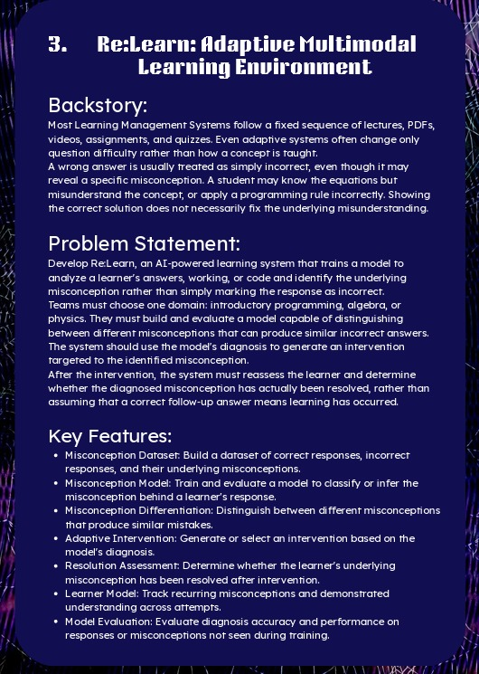

# Re:Learn — Official Problem Statement & Architectural Alignment

## 1. Official Problem Statement

### 📖 Backstory
> Most Learning Management Systems follow a fixed sequence of lectures, PDFs, videos, assignments, and quizzes. Even adaptive systems often change only question difficulty rather than how a concept is taught.
> 
> A wrong answer is usually treated as simply incorrect, even though it may reveal a specific misconception. A student may know the equations but misunderstand the concept, or apply a programming rule incorrectly. Showing the correct solution does not necessarily fix the underlying misunderstanding.

---

### 🎯 Core Problem Statement
> **Develop Re:Learn**, an AI-powered learning system that trains a model to analyze a learner's answers, working, or code and identify the underlying misconception rather than simply marking the response as incorrect.
> 
> Teams must choose one domain: **introductory programming, algebra, or physics**. (Our chosen domain: **Secondary / Class 10 & 9 Physics**).
> 
> They must build and evaluate a model capable of **distinguishing between different misconceptions that can produce similar incorrect answers**.
> 
> The system should use the model's diagnosis to **generate an intervention targeted to the identified misconception**.
> 
> After the intervention, the system must **reassess the learner and determine whether the diagnosed misconception has actually been resolved**, rather than assuming that a correct follow-up answer means learning has occurred.

---

### 🔑 Seven Mandatory System Features & Architectural Mapping

| # | Mandatory Feature (Problem Statement) | Re:Learn Implementation in Codebase | Relevant Files |
|---|---|---|---|
| **1** | **Misconception Dataset**: Build a dataset of correct responses, incorrect responses, and their underlying misconceptions. | 2,500 stratified multimodal responses (60% misconceptions, 20% correct, 7% slips, 7% units, 6% unsure) across 25 NCERT curriculum families. | `dataset/individual_response_dataset/` |
| **2** | **Misconception Model**: Train and evaluate a model to classify or infer the misconception behind a learner's response. | **Model A (Individual Classifier)**: Evaluates student working/text using TF-IDF / DeBERTa baseline with confidence scoring and abstention. | `dataset/models_and_baselines/train_individual_classifier.py` |
| **3** | **Misconception Differentiation**: Distinguish between different misconceptions that produce similar mistakes. | Codified 4 specific disambiguation discrimination probe pairs where two distinct naive models produce identical wrong numbers. | `dataset/diagnostic_discrimination_pairs/disambiguation_cases.json` |
| **4** | **Adaptive Intervention**: Generate or select an intervention based on the model's diagnosis. | Predict-Observe-Explain (POE) cognitive conflict sequences mapped to PhET Interactive Simulations (CCK DC, Bending Light, Gravity Force Lab). | `dataset/adaptive_interventions/intervention_catalogue.json` |
| **5** | **Resolution Assessment**: Determine whether the learner's underlying misconception has been resolved after intervention. | Isomorphic pre/post test items testing near-transfer in a different visual/numerical context rather than identical recall. | `dataset/adaptive_interventions/reassessment_item_pairs.json` |
| **6** | **Learner Model**: Track recurring misconceptions and demonstrated understanding across attempts. | **Model B (Sequence Pattern Analyzer)**: Evaluates 1,000 multi-turn longitudinal student sessions to track persistent vs transient errors. | `dataset/sequence_dataset/`, `train_sequence_analyzer.py` |
| **7** | **Model Evaluation**: Evaluate diagnosis accuracy and performance on responses or misconceptions not seen during training. | Leak-free stratified test sets (450 test items / 150 test sequences), reporting macro precision, recall, F1, and abstention behavior. | `train_individual_classifier.py`, `train_sequence_analyzer.py` |

---

## 2. Multimodal AI Models & System Implementation Plan (Summary of 11-Page Guidance)

### Model 1: Multimodal Response Diagnosis (Core Diagnostic Classifier)
- **Role**: Predicts which misconception (if any) best explains an individual student's response.
- **Two Sub-tasks**:
  1. *Detection*: Identify whether response is a conceptual misconception, correct, careless calculation slip, unit conversion error, or insufficient evidence.
  2. *Differentiation*: Distinguish between competing misconceptions producing similar wrong answers.
- **Multimodal Strategy**: Modular pipeline where OCR (PaddleOCR) or VLM extracts text/diagrams from handwriting or student drawings, then passes structured text + diagram metadata to the diagnosis classifier.

### Model 2: Sequence-Based Misconception Detection (Added Feature)
- **Role**: Analyzes the ordered series of a student's responses over time.
- **Value**: Distinguishes persistent entrenched misconceptions (requiring intervention) from transient slips (requiring simple arithmetic reminders), and detects cognitive remediation after POE intervention.
- **Recommended Approach**: Rule-based baseline + small recurrent architecture (GRU).

### Non-Model System Components
- **Diagnosis Service**: Combines Model 1 predictions with Model 2 history; asks follow-up probing questions if confidence is ambiguous.
- **Intervention Generation**: Pretrained LLM (Qwen2.5-7B-Instruct / Qwen2.5-3B-Instruct) using Retrieval-Augmented Generation (RAG) over reviewed NCERT physics material.
- **Reassessment Engine**: Rule-driven selection of near-transfer isomorphic items from the reviewed item bank.
- **Learner Tracking**: Bayesian Knowledge Tracing (BKT) / mastery state updating in database.
